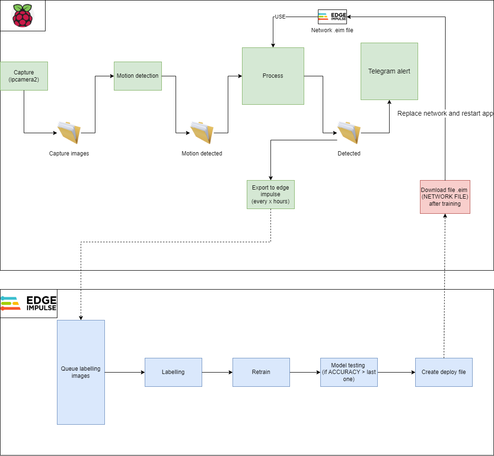

Structure
---------------

Capture app - captures and saves photos from the camera connected to RaspberryPi
Motion app - performs motion detection over a given perimeter
Classify app - using neural network trained on Edge Impulse to detect objects in images from the input folder. Saves the images in which the objects of interest were found on "detected" folder
Upload app - upload images from "detected" folder to Edge Impulse Addnotation Queue

How to install
---------------
Install Python >3.9
Install requirements
'''python
pip install -r requirements.txt
'''
Install Edge Impulse CLI

How to run
---------------

'''python
python picamera.py

python motion.py /root/edge/linux-sdk-python/pictures

python classify-image.py network.eim /root/edge/linux-sdk-python/working/motion

python upload.py
'''